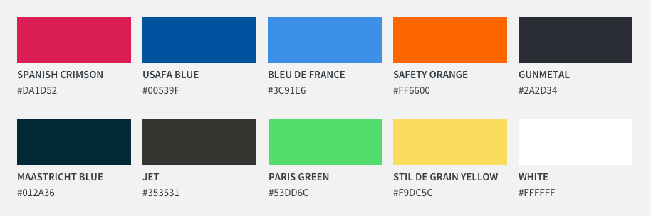
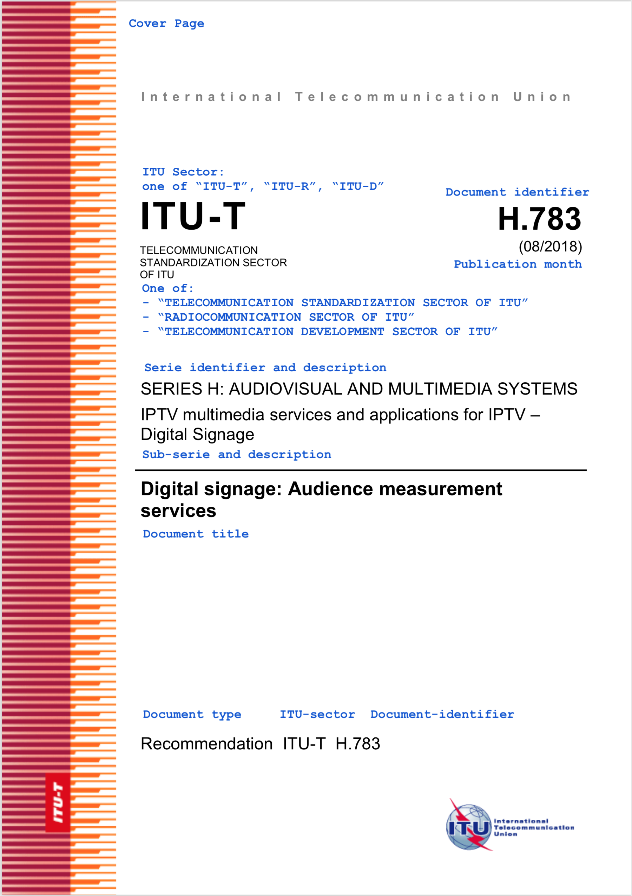
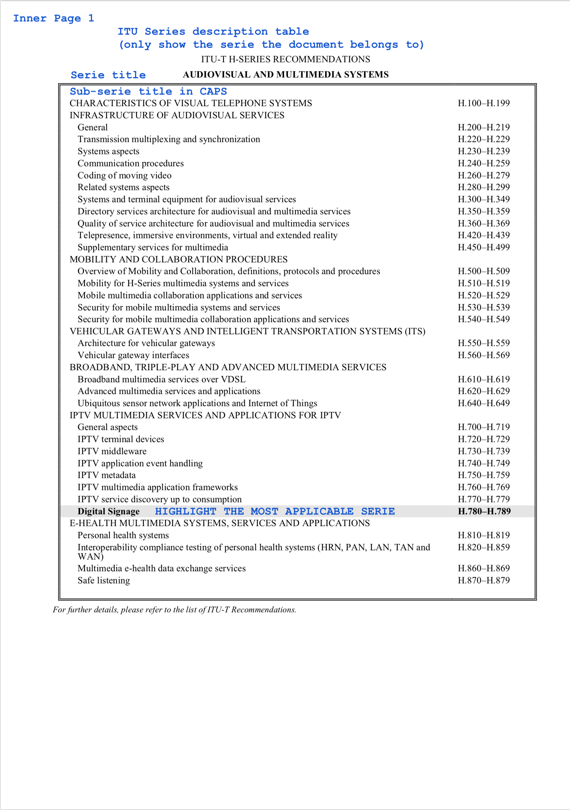
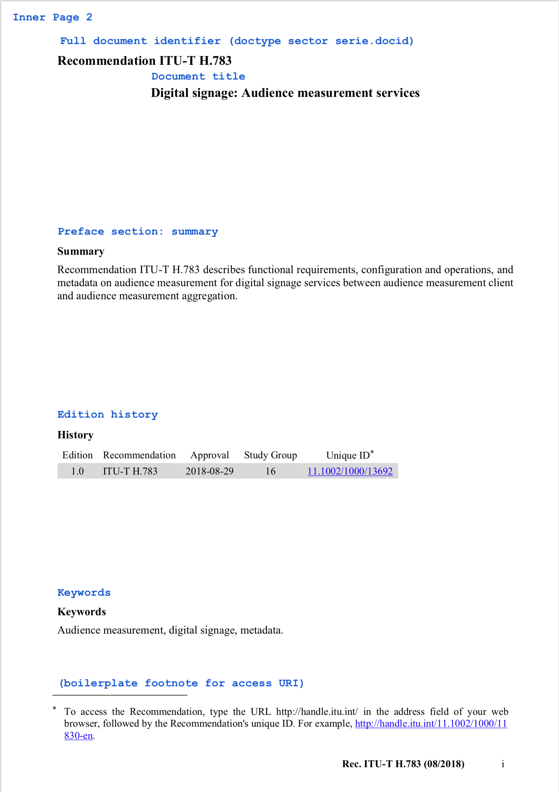
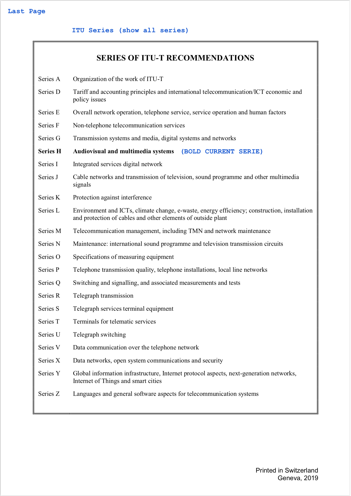

= Metanorma styling for ITU

== Input

=== Color palette

This color palette is generated from the three colors used by ITU:

* `#00539F` the blue color for text in the ITU logo
* `#DA1D52` the red color in the ITU logo
* `#FF6600` the orange color used in the colorful edge in the cover page of ITU-T Recommendations

[cols="1,1"]
|===

|USAFA BLUE | 00539F
|SPANISH CRIMSON | DA1D52
|SAFETY ORANGE | FF6600
|BLUE DE FRANCE | 3C91E6
|PARIS GREEN | 53DD6C
|STIL DE GRAIN YELLOW | F9DC5C
|JET | 353531
|GUNMETAL | 2A2D34
|MAASTRICHT BLUE | 012A36
|WHITE | FFFFFF

|===

=== Existing design

ITU documents have these cover pages.

The resulting HTML should look professional like them.

==== Cover page

==== Series page (Inner page 1)

==== Title page (Inner page 2)

==== End page (last page)

